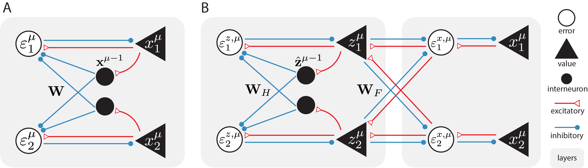

# Sequential memory with temporal predictive coding



## 1. Description
This repository contains code to perform experiments with **temporal predictive coding** in sequence memory tasks, which is discussed in the NeurIPS 2023 paper [Sequential Memory with Temporal Predictive Coding](https://proceedings.neurips.cc/paper_files/paper/2023/hash/8a8b9c7f979e8819a7986b3ef825c08a-Abstract-Conference.html).

## 2. Installation
To run the code, you should first install [Anaconda](https://www.anaconda.com/) or [Miniconda](https://conda.io/miniconda.html) (preferably the latter), 
and then clone this repository to your local machine.

Once these are installed and cloned, you can simply use the appropriate `.yml` file to create a conda environment. 
For Ubuntu or Mac OS, open a terminal, go to the repository directory; for Windows, open the Anaconda Prompt, and then enter:

1. `conda env create -f environment.yml`  
2. `conda activate seqmemenv`
3. `pip install -e .`  

## 3. Use
Once the above are done, you can simply run a script by entering for example:

`python multilayer.py`

A directory named `results` will the be created to store all the data and figures collected from the experiments.

## 4. Citation
For those who find our work useful, here is how you can cite it:
```
@inproceedings{NEURIPS2023_8a8b9c7f,
 author = {Tang, Mufeng and Barron, Helen and Bogacz, Rafal},
 booktitle = {Advances in Neural Information Processing Systems},
 editor = {A. Oh and T. Neumann and A. Globerson and K. Saenko and M. Hardt and S. Levine},
 pages = {44341--44355},
 publisher = {Curran Associates, Inc.},
 title = {Sequential Memory with Temporal Predictive Coding},
 url = {https://proceedings.neurips.cc/paper_files/paper/2023/file/8a8b9c7f979e8819a7986b3ef825c08a-Paper-Conference.pdf},
 volume = {36},
 year = {2023}
}
```

## 5. Contact
For any inquiries or questions regarding the project, please feel free to contact Mufeng Tang at <mufeng.tang@ndcn.ox.ac.uk>. 